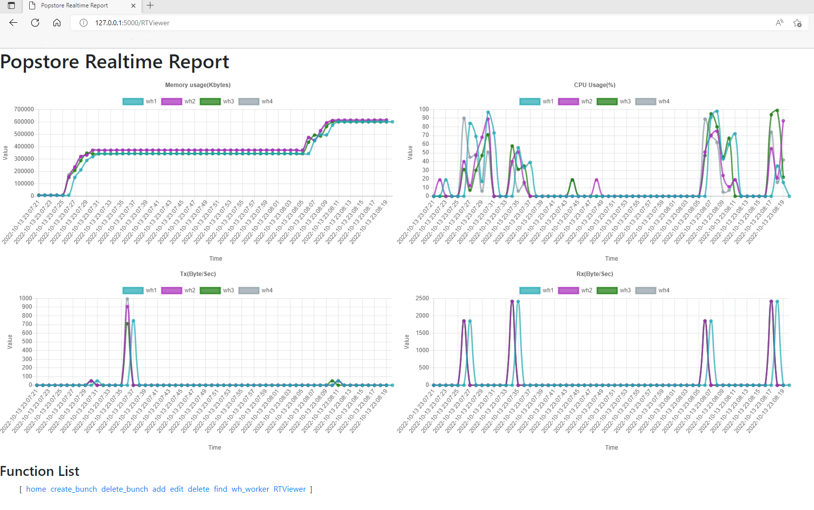

.. -*- coding: utf-8 -*-
.. :Project:  metapensiero.pj -- readme
.. :Created:  mar 01 mar 2016 15:52:36 CET
.. :Author:   Alberto Berti <alberto@metapensiero.it>
.. :License:  GNU General Public License version 3 or later
..

======================================================
popstore : a Python driver for xPopcornStore
======================================================

It is based on previous work by `Jesse Kim <jesse@nextwith.com>`_.

 :author: Jesse Kim
 :contact: jesse@nextwith.com
 :license: GNU General Public License version 3(GPLv3) or later
 .. contents:: Table of Contents
   :backlinks: top

Introduction
------------

popstore is a free software created and provided as a python driver to access the xPopcornStore DBMS.

It contains communication software including middleware provided so that xPopcornStore can understand all operations provided through Python.
following:

1) Provides communication module to access DBMS.
2) It supports data addition, modification, and deletion functions and provides APIs to access information from multiple warehouses.
3) Provides API for data retrieval and supports using iteragtor function through it.
4) Provides file I/O APIs that support parallel or distributed processing. This allows support for parallel operations in Python.
5) Provides an interface that supports data in-memory in parallel for high-speed data processing.

popstore requires the JavaScripthon module, which will require python 3.7 or higher.

Installation
------------

Python 3.5 is required because Python's AST has changed between 3.4
and 3.5 and as of now supporting multiple Python versions is not one
of my priorities.

To install the package execute the following command::

  $ pip install popstore

or, if you want install it from sources::

  $ git clone https://github.com/jesseneverdie/popstore

Additional Resources
------------

